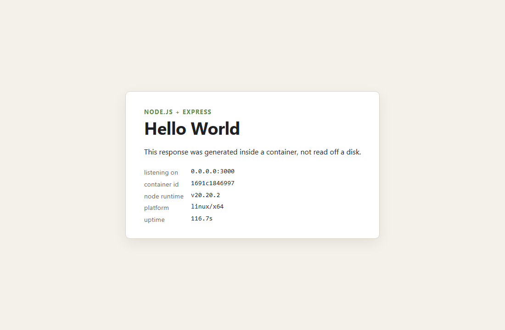
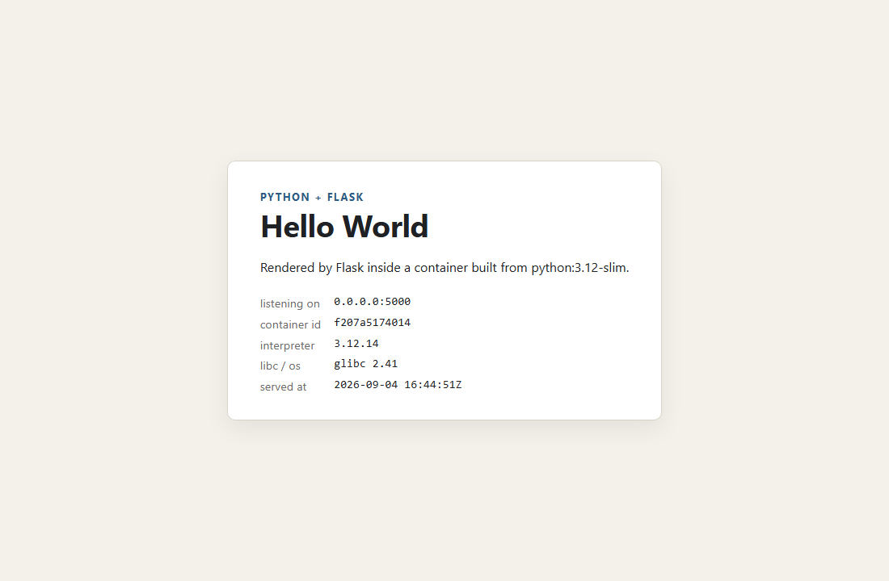
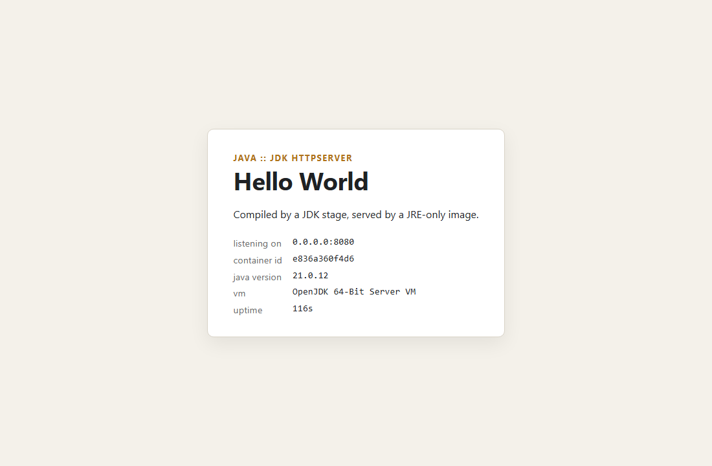
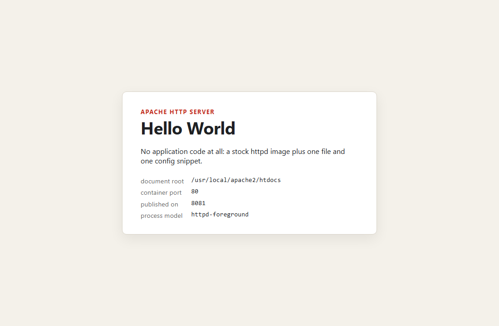
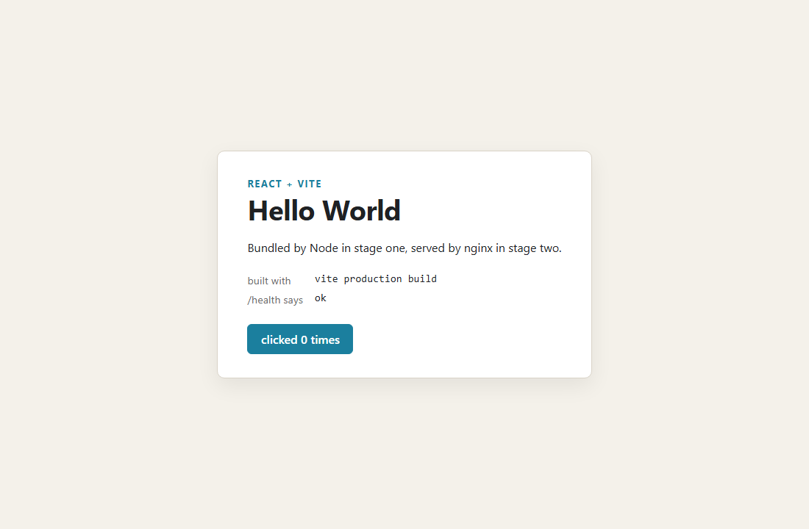
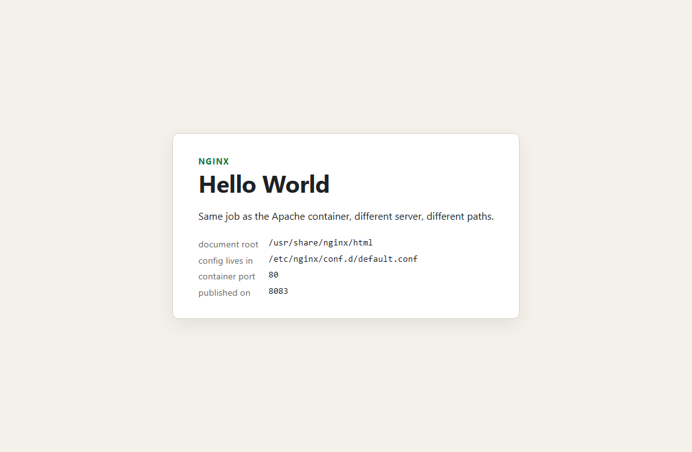

# Docker Fundamentals — six Hello World web apps

**Name:** Anantha  **Enrollment Number:** _(fill in)_  **Date:** 4 September 2026

Six small web apps, six Dockerfiles, one image each. All six were built and run on Docker Engine
29.7.2 (Docker Desktop, WSL2 backend) and every piece of output quoted below is copied from that
run — the full logs are in [`output/`](output/).

```
Docker Fundamentals/
├── README.md
├── apps.manifest             the app list the harness reads (folder|image|ports|marker)
├── build-and-run.sh          build / up / check / down / purge
├── verify-local.sh           runs the same apps on the host, no Docker involved
├── nodejs-app/    Node 20 + Express        :3000   server.js, page.js, Dockerfile
├── python-app/    Python 3.12 + Flask      :5000   app.py, requirements.txt, Dockerfile
├── java-app/      Java 21, JDK HttpServer  :8080   src/HelloWorld.java, Dockerfile (2 stages)
├── Apache-app/    httpd 2.4                :8081   index.html, extra.conf, Dockerfile
├── React-app/     React 18 + Vite → nginx  :8082   src/, nginx.conf, Dockerfile (2 stages)
├── nginx-app/     nginx 1.27               :8083   index.html, nginx.conf, Dockerfile
├── screenshots/              one render per app
└── output/
    ├── build-and-run.txt        the full harness run
    ├── evidence.txt             ps, images, page markers, headers, 404 behaviour
    └── experiment-loopback.txt  the 127.0.0.1 bug, reproduced deliberately
```

## Result

```
== checking each app
   PASS  ana-node    HTTP 200  http://localhost:3000
   PASS  ana-python  HTTP 200  http://localhost:5000
   PASS  ana-java    HTTP 200  http://localhost:8080
   PASS  ana-apache  HTTP 200  http://localhost:8081
   PASS  ana-react   HTTP 200  http://localhost:8082
   PASS  ana-nginx   HTTP 200  http://localhost:8083

== result: 6 passed, 0 failed
```

## Running it

```bash
cd "Docker Fundamentals"
bash build-and-run.sh              # build, start, check
bash build-and-run.sh check java   # any subcommand takes a name filter
bash build-and-run.sh down         # stop and remove the six containers
bash verify-local.sh               # same apps, no Docker, ports 13000/15000/18080
```

Or by hand, one app:

```bash
docker build -t ana-node nodejs-app
docker run -d --name ana-node -p 3000:3000 ana-node
curl -s http://localhost:3000/health
docker logs ana-node
docker rm -f ana-node
```

Port 8080 is shared with the multi-stage app in `DockerFiles and images/`, so run one folder at a
time or change the host port — `-p` is the left-hand number and nothing in the image cares.

## The six pages

| Node.js (3000) | Python (5000) | Java (8080) |
|---|---|---|
|  |  |  |

| Apache (8081) | React (8082) | Nginx (8083) |
|---|---|---|
|  |  |  |

Each page prints facts the container knows about itself — its hostname (which is the container ID),
the runtime version, the address it bound to. That is deliberate: it makes a screenshot evidence of
*which* container answered rather than just a picture of the words "Hello World".

The React shot is worth a second look. `built with vite production build` and `/health says ok` are
both filled in by JavaScript after the page loads, so that screenshot proves two things at once:
the bundle Vite produced inside the image really executes, and the nginx config in stage two really
is the one being served.

## docker ps / docker images

```
NAMES        IMAGE        STATUS                    PORTS
ana-nginx    ana-nginx    Up 22 seconds             0.0.0.0:8083->80/tcp, [::]:8083->80/tcp
ana-react    ana-react    Up 23 seconds             0.0.0.0:8082->80/tcp, [::]:8082->80/tcp
ana-apache   ana-apache   Up 24 seconds             0.0.0.0:8081->80/tcp, [::]:8081->80/tcp
ana-java     ana-java     Up 25 seconds             0.0.0.0:8080->8080/tcp, [::]:8080->8080/tcp
ana-python   ana-python   Up 26 seconds             0.0.0.0:5000->5000/tcp, [::]:5000->5000/tcp
ana-node     ana-node     Up 27 seconds (healthy)   0.0.0.0:3000->3000/tcp, [::]:3000->3000/tcp
```

Two details in that table:

- **`(healthy)`** appears only on `ana-node`, because that is the only image with a `HEALTHCHECK`.
  Docker is running `wget -qO- http://127.0.0.1:3000/health` inside the container every 15 seconds
  and reporting the verdict. The others are only "Up", which means the process has not exited —
  a much weaker claim than "it is answering requests".
- The port column reads `host->container`. `8081->80` and `8080->8080` are both correct; the second
  number is whatever the app inside was written to listen on and the first is what I chose to
  publish it as.

```
REPOSITORY   TAG       SIZE
ana-react    latest    73.9MB
ana-nginx    latest    73.7MB
ana-apache   latest    96.2MB
ana-java     latest    454MB
ana-python   latest    196MB
ana-node     latest    204MB
```

`ana-react` is the number to look at. That image was built by a stage containing Node, npm and a
`node_modules` tree, and it comes out at 73.9MB — 0.2MB more than the bare nginx image next to it.
Everything the build needed was left behind in the first stage. A single-stage version of the same
app would have shipped the whole toolchain, roughly 400MB, to serve about 150KB of static files.

`ana-java` at 454MB tells the same story less dramatically: the JRE runtime image is 459MB, the JDK
one is 726MB, so compiling in a throwaway stage saved ~270MB.

## What each Dockerfile is there to show

They are deliberately not six copies of the same file.

**`nodejs-app`** — cache ordering and a real `HEALTHCHECK`. `COPY package.json` and
`npm install` sit above `COPY server.js page.js`, so editing the app does not reinstall Express;
Docker only re-runs an instruction when that instruction's inputs change. The image also declares
a healthcheck, which is why `docker ps` can say `healthy` for this one and not for the others.
Runs as the built-in `node` user.

**`python-app`** — base-image choice and logging. `python:3.12-slim`, not `-alpine`: Alpine uses
musl, PyPI's prebuilt wheels are built for glibc, so on Alpine any dependency with a C extension
compiles from source. `PYTHONUNBUFFERED=1` is not cosmetic — without it stdout is block-buffered
when it is not a terminal and `docker logs` stays empty long enough to convince you the app is
hung. The page prints `platform.libc_ver()` so the glibc claim is visible rather than asserted.

**`java-app`** — multi-stage, the plain version. Stage `build` is a JDK and runs `javac`; the
second stage is a JRE and receives `/work/classes` through `COPY --from=build`. No compiler, no
source, no build cache in the shipped image.

**`Apache-app`** — an image with no application code, plus where httpd keeps its config. The
document root is `/usr/local/apache2/htdocs` (nginx's is `/usr/share/nginx/html`, and mixing the
two up is the usual reason a page 404s after switching servers). Rather than replacing
`httpd.conf`, the Dockerfile appends one `Include` line to it, ships `extra.conf`, enables
`mod_headers` with `sed`, and then runs `httpd -t` so a broken config fails the *build*. There is
no `CMD`: the base image ends with `CMD ["httpd-foreground"]`, and the `-foreground` half is the
part that matters, because a daemonised server would exit the foreground process and Docker would
declare the container finished.

**`React-app`** — multi-stage, the version that actually pays for itself, plus SPA routing. Stage
one runs `npm install` and `vite build`; stage two is `nginx:alpine` plus `/app/dist`. Two guards
were added after thinking about how this fails: `RUN test -f /app/dist/index.html` in stage one, so
a build that silently produces nothing fails loudly, and `RUN nginx -t` in stage two, so a bad
config is a build error instead of a container that dies one second after `docker run`.

**`nginx-app`** — configuration as the whole point, and a deliberate contrast with the React image.
Same server, same base image, but `try_files $uri $uri/ =404;` instead of the SPA fallback. This
one hosts real files, so a request for a file that does not exist *is* an error and should say so.

Measured, from `output/evidence.txt`:

```
nginx-app  /nope -> 404      static site: missing file is an error
React-app  /nope -> 200      SPA: unknown path is handed to React to route
java-app   /nope -> 404      my own handler, because createContext("/") is a prefix match
```

## Proving each custom config is the one in force

An image built from `nginx:alpine` serves a page whether or not my `nginx.conf` was picked up, so
"the page loads" proves nothing about the config. Both servers therefore set a header the stock
images never set:

```
$ curl -sI http://localhost:8081/          $ curl -sI http://localhost:8083/
HTTP/1.1 200 OK                            HTTP/1.1 200 OK
Server: Apache/2.4.68 (Unix)               Server: nginx/1.27.5
X-Served-By: apache-container              X-Served-By: nginx-container
```

Same trick on the React container, where the caching rules are the thing being claimed:

```
$ curl -sI http://localhost:8082/
HTTP/1.1 200 OK
Cache-Control: no-store          <- index.html must never be cached
$ curl -s http://localhost:8082/ | grep -o '/assets/[^"]*\.js'
/assets/index-Ig63Hrjp.js        <- fingerprinted, so it can be cached for a year
```

That pairing is the standard way to cache a single-page app: the entry document is never cached,
every asset it references has a content hash in its filename, so a deploy can never serve a new
`index.html` with stale JavaScript.

## The bug I went looking for

The most common "my container does not work" is a server bound to loopback. Instead of writing
that down as a fact I changed one line — `BIND = '0.0.0.0'` to `'127.0.0.1'` — rebuilt, and
captured what it looks like ([`output/experiment-loopback.txt`](output/experiment-loopback.txt)):

```
$ docker ps --filter name=ana-node-loopback
NAMES               STATUS                            PORTS
ana-node-loopback   Up 3 seconds (health: starting)   0.0.0.0:3999->3000/tcp

$ docker logs ana-node-loopback
ana-node up on http://127.0.0.1:3000

$ curl -sS -m 5 http://localhost:3999/
curl: (52) Empty reply from server

$ docker exec ana-node-loopback wget -qO- http://127.0.0.1:3000/ | head -3
<!doctype html>
<html lang="en">
<head>
```

Everything that usually reassures you is green. The container is up, the port mapping is exactly
right, the log says the server started, and the app answers perfectly — *from inside*. A container
has its own network namespace, so `127.0.0.1` there means "this container only", and Docker's
port forward lands on a socket that refuses the connection.

Two things I took from running it rather than reading it:

1. The error is `curl: (52) Empty reply from server`, not "connection refused". The forward exists;
   what is behind it hangs up. Knowing the exact wording is what makes this five seconds to
   diagnose next time.
2. `docker ps` said `health: starting` and, left alone, would have moved to `unhealthy` — the only
   signal in the whole picture that noticed anything was wrong was the `HEALTHCHECK`. That is the
   argument for declaring one.

## Notes

- **`EXPOSE` publishes nothing.** It is metadata. `-p` is what opens a host port. I kept `EXPOSE`
  in every Dockerfile anyway because it documents the contract, and `docker run -P` uses it.
- **Exec form for `CMD`.** `CMD ["node", "server.js"]` makes node PID 1, so `docker stop` delivers
  SIGTERM to node and the container stops immediately. In shell form the process is a child of
  `/bin/sh`, the signal goes to the shell, and every stop takes the full ten-second grace period.
- **`.dockerignore` before anything else.** Without it the whole build context — `node_modules`
  included — is packed and sent to the daemon. Beyond being slow, Windows-built native modules
  would be copied into a Linux image and fail at runtime in a way that looks like a code bug.
- **Check the container, not the port.** The harness asks `docker inspect` whether the container is
  `running` *before* it curls anything, and then greps for a marker unique to that app. A check
  that only curls a port will happily pass because some other container answered — the whole reason
  `apps.manifest` carries a marker column.
- **Config errors belong at build time.** `nginx -t` and `httpd -t` run inside their Dockerfiles.
  It costs a second and turns "container exits instantly for no visible reason" into a build that
  fails with the line number.
- Screenshots were taken with headless Chrome against the live containers. Chrome refused to write
  a file until it was given its own `--user-data-dir`, which is worth knowing if you script this.
