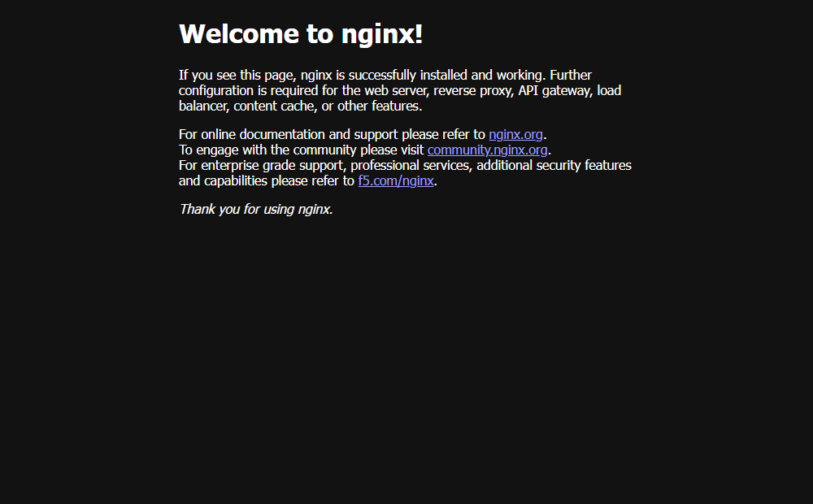
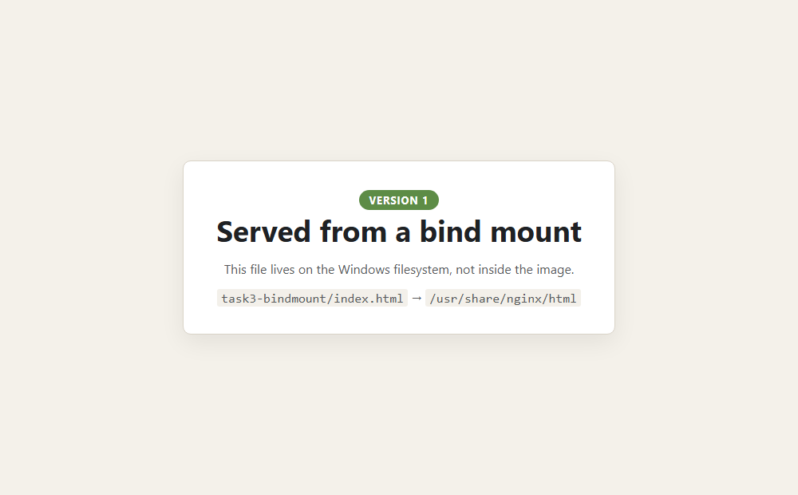

# Docker networking and volumes

**Name:** Anantha  **Enrollment Number:** _(fill in)_  **Date:** 4 September 2026

Four tasks. Tasks 1–3 were run against Docker Engine 29.7.2 and every line quoted here comes from
those runs; task 4 is written up rather than run, because an overlay network needs a Swarm with
more than one host.

```
Docker network/
├── README.md
├── task1-networking.sh        3 networks, 4 containers, a connectivity matrix
├── task2-host-network.sh      --network host, and the Docker Desktop caveat
├── task3-bindmount.sh         bind mount, live edit, read-only enforcement
├── task3-bindmount/
│   └── index.html             the file that gets mounted
├── screenshots/
└── output/                    full log of each script
```

```bash
bash task1-networking.sh        # add `clean` to any of them to tear down
bash task2-host-network.sh
bash task3-bindmount.sh
```

Ports used: 8180 (gateway), 8181 (published Apache), 8182 (bind mount), 8183 (host-mode Apache).

## Task 1 — user-defined bridge networks

```
    gateway ──[ edge-net ]── service ──[ core-net ]── store
     nginx                    nginx     (on BOTH)     postgres:16
    :8180                                             no published port

    castaway ──[ island-net ]      third network, one container, no neighbours
```

```bash
docker network create edge-net core-net island-net

docker run -d --name gateway  --network edge-net -p 8180:80 nginx:alpine
docker run -d --name service  --network edge-net nginx:alpine
docker run -d --name store    --network core-net \
    -e POSTGRES_PASSWORD=... -e POSTGRES_DB=appdb postgres:16-alpine
docker run -d --name castaway --network island-net nginx:alpine

docker network connect core-net service    # a container can join more than one
```

`docker run` takes only one `--network`, so `service` gets its second membership afterwards. That
is the whole mechanism behind a tiered setup: the middle tier is the only thing on both networks.

Addresses actually handed out:

```
  gateway   edge-net=172.21.0.2
  service   edge-net=172.21.0.3 core-net=172.22.0.3
  store     core-net=172.22.0.2
  castaway  island-net=172.23.0.2
```

`service` has two addresses on two different subnets, one per network it joined.

### The connectivity matrix

```
--- connections that SHOULD work (a shared network)
  gateway   -> service   :80    OK
  service   -> gateway   :80    OK
  service   -> store     :5432  OK

--- connections that SHOULD fail (no shared network)
  gateway   -> castaway  :80    unreachable
  castaway  -> service   :80    unreachable
  gateway   -> store     :5432  unreachable
```

Every probe runs inside a container and addresses the target **by name**, never by IP. That is the
first thing a user-defined network buys you: Docker runs an embedded DNS server that answers for
container names. On the default `bridge` network it does not, and you are stuck hardcoding
addresses that change on every restart.

### The failures are the interesting half

```
$ docker exec gateway nslookup store
** server can't find store: NXDOMAIN

$ docker exec gateway nslookup service
Name:	service
Address: 172.21.0.3
```

`gateway` is not *blocked* from reaching `store` — it cannot work out an address for it at all.
Docker's DNS only answers for containers that share a network with the asker, so isolation happens
one step earlier than a firewall would do it. A compromised front end cannot even name the database.

The two allowed paths, working:

```
$ docker exec gateway wget -q -O - http://service/
<!DOCTYPE html>
<html>
<head>
<title>Welcome to nginx!</title>

$ docker exec store psql -U postgres -d appdb -c 'SELECT version();'
 PostgreSQL 16.15 on x86_64-pc-linux-musl, compiled by gcc (Alpine 15.2.0) 15.2.0, 64-bit
```



`store` has **no published port**. It is reachable from `service` and from nothing else — not from
`gateway`, not from `castaway`, not from Windows. Nothing about that required a firewall rule; it
is a consequence of which networks it joined.

One thing I changed after a first attempt: the readiness check. Waiting on "is the container
running" is not the same as "will it answer", and Postgres opens its unix socket before it accepts
TCP. `pg_isready -h 127.0.0.1` checks over TCP, which is the path clients actually use, and it
reported ready after 2 seconds. A readiness check that uses a different path from the client is a
readiness check that can lie.

## Task 2 — `--network host`

```bash
docker run -d --name ana-apache-hostnet --network host httpd:2.4-alpine \
  sh -c "sed -i 's/^Listen 80$/Listen 8183/' conf/httpd.conf && httpd-foreground"
```

Apache is told to listen on 8183 rather than 80 because in host mode there is no mapping available
to move it out of the way of whatever else is on the machine. That is the first consequence: you
are binding real ports on the host and you have to know what is already there.

```
$ docker ps --filter name=ana-apache-hostnet
NAMES                STATUS         PORTS
ana-apache-hostnet   Up 3 seconds
```

The PORTS column is empty and that is correct — there is no mapping because there is no separate
namespace to map out of. Docker also says so if you try:

```
$ docker run --rm --network host -p 9999:80 alpine:3.20 true
WARNING: Published ports are discarded when using host network mode
```

From inside the Docker host it works:

```
$ docker run --rm --network host alpine:3.20 wget -q -O - http://localhost:8183/
<title>It works! Apache httpd</title>

$ docker run --rm --network host alpine:3.20 netstat -tln | grep ':8183 '
tcp   0   0 :::8183   :::*   LISTEN
```

From Windows it does not:

```
$ curl http://localhost:8183/
HTTP 000        (no response)
```

Nothing is broken. Docker Desktop does not run Linux containers on Windows — it runs them in a
WSL2 virtual machine, and *that VM* is the Docker host. `--network host` attached Apache to the
VM's network stack, so it genuinely is on port 8183 of the Docker host, just not on port 8183 of
Windows. On a Linux machine there is no VM in between and `http://localhost:8183` answers straight
away.

Published normally, the same image is reachable from Windows immediately:

```
$ docker run -d --name ana-apache-published -p 8181:80 httpd:2.4-alpine
$ curl -I http://localhost:8181/
HTTP/1.1 200 OK
Server: Apache/2.4.68 (Unix)
```


**When host networking earns its place:** raw throughput, because it skips Docker's NAT hop;
services that open many ports; protocols NAT breaks (DHCP, mDNS, anything broadcast, anything that
needs the real client IP); monitoring agents that must see the host's interfaces.

**What it costs:** no network isolation at all — the container can bind any host port and see
traffic that is none of its business; port collisions with the host and with every other host-mode
container; and, as demonstrated above, no portability.

## Task 3 — bind mounts

```bash
MSYS_NO_PATHCONV=1 docker run -d --name ana-bindmount -p 8182:80 \
  -v "$PWD/task3-bindmount:/usr/share/nginx/html:ro" nginx:alpine
```

```
$ docker inspect ana-bindmount --format '{{range .Mounts}}...{{end}}'
  type=bind  ro=true
  source=/c/Users/anantha/.../anantha/Docker network/task3-bindmount
  target=/usr/share/nginx/html
```

`type=bind` — it points at a directory I chose. A named volume would say `type=volume` and live
under Docker's own data root.

### The live edit

| before | after |
|---|---|
|  |  |

Between those two screenshots the only thing that happened was `sed` editing a file on the Windows
filesystem. No `docker` command ran at all:

```
--- version 1, as served
  <span class="v">VERSION 1</span>
  <h1>Served from a bind mount</h1>

--- editing the file ON THE HOST -- the container is not touched

--- version 2, as served -- same container, no restart
  <span class="v">VERSION 2</span>
  <h1>Edited while it was running</h1>
NAMES           STATUS
ana-bindmount   Up 2 seconds        <- uptime never reset
```

The container is not holding a copy. nginx opens the host file on every request, so the host
directory *is* the document root. That is exactly why bind mounts are the development setup — edit,
refresh, done — and exactly why they are a bad production setup: the image stops being
self-contained and starts depending on a directory existing on whatever machine runs it.

### `:ro` is enforced by the kernel

```
$ docker exec ana-bindmount sh -c 'echo tampered >> /usr/share/nginx/html/index.html'
sh: can't create /usr/share/nginx/html/index.html: Read-only file system
```

Root inside the container cannot write to it. That is what makes a bind mount a reasonable way to
hand a container config it has no business editing.

### The mount replaces, it does not merge

```
$ docker exec ana-bindmount ls /usr/share/nginx/html
index.html                          <- only mine

$ docker run --rm nginx:alpine ls /usr/share/nginx/html
50x.html
index.html                          <- the image's own files, still there
```

Mounting over a directory hides whatever the image had there. The originals are untouched and
reappear the moment the mount is removed.

### bind mount vs named volume vs tmpfs

| | Syntax | Where the data lives | Use it for |
|---|---|---|---|
| bind mount | `-v /abs/path:/in/container` | a host directory you name | development, config files |
| named volume | `-v myvol:/in/container` | Docker's data root, managed | databases, anything persistent |
| tmpfs | `--tmpfs /in/container` | RAM, gone on stop | secrets, scratch data |

How Docker tells the first two apart: if the part before the colon starts with `/` or a drive
letter it is a bind mount, otherwise it is a volume *name* and Docker creates it. Writing
`-v data:/var/lib/postgresql/data` when you meant `./data` silently gives a volume, and everything
works until you go looking for the files on disk.

Also: a bind mount whose source does not exist is **not** an error. Docker creates an empty
directory and mounts it, so a typo in the path shows up as an inexplicably empty document root.

### The Git Bash trap

The first run of `task3-bindmount.sh` printed this for a path I never typed:

```
ls: C:/Program Files/Git/usr/share/nginx/html: No such file or directory
```

Git Bash rewrites anything that looks like a Unix path into a Windows path before Docker sees the
argument. It affects `-v` and `docker exec` alike. The fix is a prefix on the command:

```bash
MSYS_NO_PATHCONV=1 docker exec ana-bindmount ls /usr/share/nginx/html
```

Linux and macOS are unaffected, and the error message names a path that appears nowhere in your
command, which is what makes it confusing the first time.

## Task 4 — overlay networks

Not run. An overlay network requires Swarm mode and is only meaningful across more than one Docker
host, and there is one machine here.

### What it is

Task 1 used the **bridge** driver: a virtual switch that exists inside a single Docker host.
Nothing outside that machine can join it.

An **overlay** network spans several Docker hosts. Containers on different physical machines get
addresses on one logical subnet and reach each other by name as if they were on the same box.

### How the packet actually travels

VXLAN encapsulation:

1. A container on host A sends a frame to `10.0.1.5`, a container on host B.
2. Host A's Docker wraps that entire Ethernet frame inside a UDP packet addressed to host B's real
   IP, on port 4789.
3. It crosses the physical network as ordinary UDP. Routers and switches in between see UDP, not
   the container's addresses.
4. Host B unwraps it and delivers the frame to the destination container.

Neither container knows any of this happened; they see a flat local network. It is a software
network laid on top of the physical one — hence "overlay". Docker keeps a distributed record of
which container lives on which host; in Swarm the managers maintain it with Raft.

Ports that must be open between hosts:

| Port | Protocol | For |
|---|---|---|
| 2377 | TCP | Swarm cluster management |
| 7946 | TCP + UDP | node discovery and gossip |
| 4789 | UDP | the VXLAN data path |

Blocking 4789 is the classic failure: the cluster forms, the nodes list each other happily, and no
container traffic goes anywhere.

### Creating one

```bash
docker swarm init                                     # on the manager
docker swarm join --token <token> <manager-ip>:2377   # on each worker

docker network create -d overlay --attachable app-overlay
docker service create --name web --network app-overlay --replicas 5 nginx
```

`--attachable` is what lets ordinary `docker run` containers join; without it only Swarm services
can. `--opt encrypted` adds IPsec — worth knowing that VXLAN traffic crosses your physical network
in clear text otherwise.

### Where it is used

- Multi-host clusters, the main case: services on several machines addressing each other by name.
- Service discovery at scale — Swarm gives each service a virtual IP and load-balances across
  replicas, so `http://web` reaches a healthy replica on whichever host it is on.
- Rolling deploys and failover, because a container can move to another host and keep its network
  identity.
- Tenant isolation across a cluster: the same idea as Task 1's separate bridges, cluster-wide.

### The drivers, side by side

| Driver | Scope | What it is for |
|---|---|---|
| `bridge` | one host | the default, and Task 1 |
| `host` | one host | share the host's stack, Task 2 |
| `overlay` | many hosts | Swarm clusters |
| `macvlan` | one host | the container gets a real MAC and IP on the physical LAN |
| `ipvlan` | one host | like macvlan but shares the host's MAC, for switches with port security |
| `none` | one host | no networking at all |

Worth being honest about: overlay is tied to Swarm, and Swarm has largely lost to Kubernetes in
production. The mechanism carries over though — Flannel does the same VXLAN trick for Kubernetes,
and Calico and Cilium are the alternatives that solve the same problem differently.

## Everything running at the end

```
NAMES                  IMAGE               PORTS
ana-bindmount          nginx:alpine        0.0.0.0:8182->80/tcp
ana-apache-published   httpd:2.4-alpine    0.0.0.0:8181->80/tcp
ana-apache-hostnet     httpd:2.4-alpine    (none — host network)
castaway               nginx:alpine        80/tcp
store                  postgres:16-alpine  5432/tcp
service                nginx:alpine        80/tcp
gateway                nginx:alpine        0.0.0.0:8180->80/tcp
```

`castaway`, `store` and `service` show a bare port with no `0.0.0.0:` in front of it — open inside
their networks, published nowhere. Only `gateway`, the two Apaches and the bind-mount container can
be reached from the host at all.

## Cleanup

```bash
bash task1-networking.sh clean     # containers and the three networks
bash task2-host-network.sh clean
bash task3-bindmount.sh clean
```
