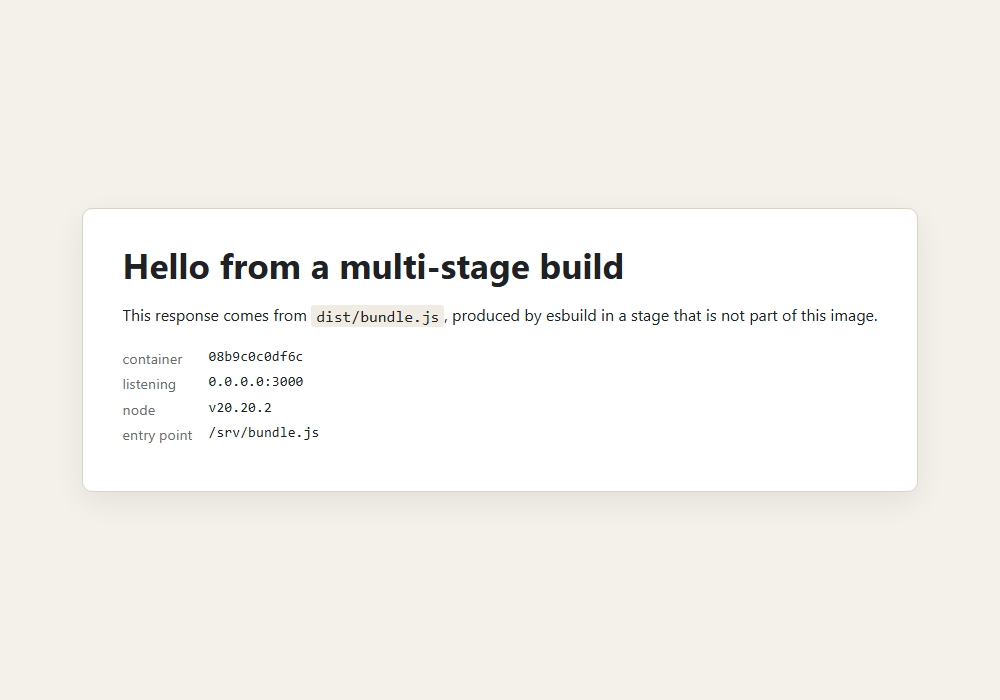
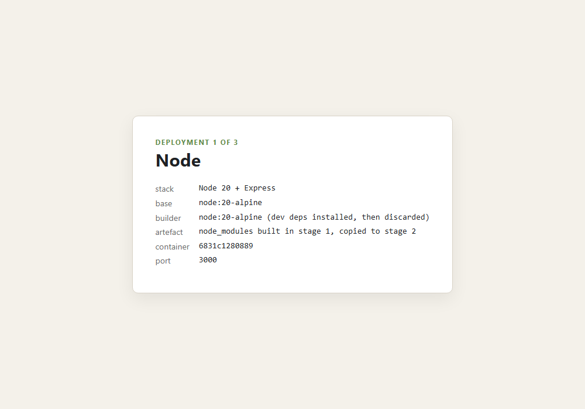
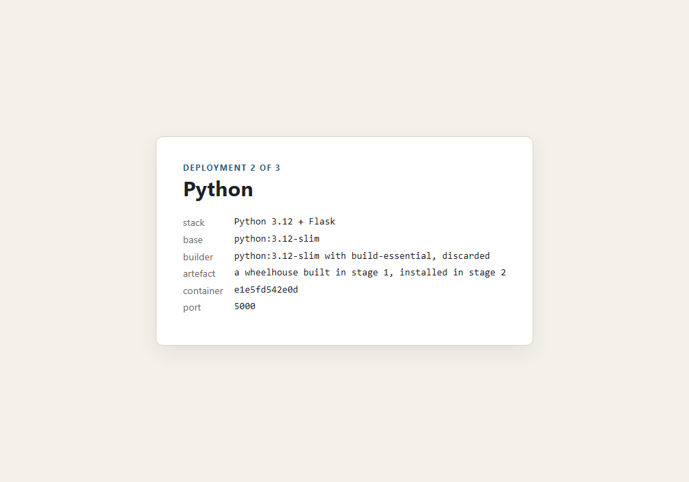
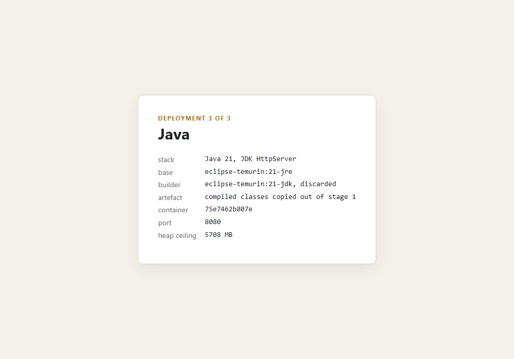

# Dockerfiles and images — multi-stage builds, layers, three deployments

**Name:** Anantha  **Enrollment Number:** _(fill in)_  **Date:** 4 September 2026

Three tasks, all run against Docker Engine 29.7.2. Every number below was measured on this
machine; the full transcript is [`output/run-all-output.txt`](output/run-all-output.txt).

```
DockerFiles and images/
├── README.md
├── run-all.sh                     all|sizes|cache|deploy|clean
├── multi-stage-app/               Task 1 — one app, two Dockerfiles
│   ├── src/app.js, src/page.js    the application
│   ├── build.js                   esbuild bundle step (the reason a build stage exists)
│   ├── Dockerfile                 two stages
│   └── Dockerfile.single          one stage, same app, for comparison
├── task3-deployments/             Task 3 — the same service three ways
│   ├── nodejs-app/    → 8091
│   ├── python-app/    → 8092
│   └── java-app/      → 8093
├── screenshots/
└── output/
    ├── run-all-output.txt         the whole run
    └── bug-head-shadowing.txt     a run that lied to me, kept as evidence
```

```bash
bash run-all.sh            # tasks 1, 2, 3
bash run-all.sh cache      # just the caching experiments
bash run-all.sh clean
```

## Task 1 — multi-stage vs single-stage

The app has a real build step: `build.js` runs esbuild over `src/` and produces `dist/bundle.js`.
That matters, because a multi-stage build only pays for itself when the build genuinely needs tools
the runtime does not. esbuild is one — about 9.5MB of platform binary that is useless once the
bundle exists.

Two Dockerfiles, same application, same page:

| Image | Dockerfile | Size |
|---|---|---|
| `ana-ms-single` | `Dockerfile.single` — install, build, run, all in one image | **239MB** |
| `ana-ms-multi` | `Dockerfile` — builder stage bundles, runtime stage serves | **199MB** |

40MB, or 17%. What is actually in the difference, read from inside the two running images:

```
single-stage:                       multi-stage:
  node_modules : 14.1M                node_modules : 4.4M
  esbuild bin  : 9.5M                 esbuild bin  : not present
  source tree  : 4.0K                 files in /srv: bundle.js  node_modules
                                                     package.json
```

The runtime image has no bundler, no source and no devDependencies — it has one 12.3kB
`bundle.js`, Express, and the base image. It serves the identical page:



Two things worth saying honestly about that 40MB. First, it is smaller than the headline numbers
people quote for multi-stage builds, because both stages here start from the same 199MB
`node:20-alpine` base — the saving can only ever be the build-only *extras*. Second, the Java
deployment in Task 3 is where the pattern really shows, because there the two stages start from
*different* bases: `eclipse-temurin:21-jdk` is 726MB and `21-jre` is 459MB, so not shipping the
compiler is worth 267MB before a single line of application code.

## Task 2 — layers and the build cache

### What a layer costs

`docker history ana-ms-multi`, newest first:

```
SIZE      CREATED BY
0B        CMD ["node" "bundle.js"]
0B        USER node
0B        EXPOSE [3000/tcp]
0B        ENV NODE_ENV=production PORT=3000
12.3kB    COPY /build/dist/bundle.js ./bundle.js
4.77MB    RUN npm install --omit=dev --no-audit --no-fund && npm cache clean --force
12.3kB    COPY package.json ./
4.1kB     WORKDIR /srv
...
130MB     RUN addgroup -g 1000 node && adduser ... && apk add ...      <- from node:20-alpine
9.11MB    ADD alpine-minirootfs-3.23.4-x86_64.tar.gz /
```

Everything I wrote adds up to under 5MB. The other 194MB came with the base image, which is the
first thing to remember about image size: the base image choice is usually the whole decision.

`ENV`, `EXPOSE`, `USER` and `CMD` are 0B. They are still layers — they still get an entry in the
history and a line in the manifest — but they only change metadata, so there is nothing to store.

### Which layers survive an edit

`run-all.sh cache` runs two builds and reports, per instruction, whether BuildKit reused the layer.

**A — edit `src/page.js`, rebuild:**

```
  CACHED    [builder 3/8] COPY package.json ./
  CACHED    [builder 4/8] RUN npm install --no-audit --no-fund
  CACHED    [builder 5/8] COPY build.js ./
  re-ran    [builder 6/8] COPY src ./src
  re-ran    [builder 7/8] RUN npm run build
  re-ran    [builder 8/8] RUN test -s dist/bundle.js && wc -c dist/bundle.js
  CACHED    [runtime 3/5] COPY package.json ./
  CACHED    [runtime 4/5] RUN npm install --omit=dev ...
  CACHED    [runtime 5/5] COPY --from=builder /build/dist/bundle.js ./bundle.js
  2 seconds
```

**B — bump the version in `package.json`, rebuild:**

```
  re-ran    [builder 3/8] COPY package.json ./
  re-ran    [builder 4/8] RUN npm install --no-audit --no-fund
  re-ran    [builder 5/8] COPY build.js ./
  re-ran    [builder 6/8] COPY src ./src
  re-ran    [builder 7/8] RUN npm run build
  re-ran    [builder 8/8] RUN test -s dist/bundle.js && wc -c dist/bundle.js
  re-ran    [runtime 3/5] COPY package.json ./
  re-ran    [runtime 4/5] RUN npm install --omit=dev ...
  re-ran    [runtime 5/5] COPY --from=builder ...
  7 seconds
```

Same rebuild, 2 seconds against 7, and the only difference is *which file* changed.

The rule the two runs demonstrate: **an instruction invalidates every instruction after it, in its
stage, whether or not they depend on it.** Nothing about `COPY build.js` cares what version number
is in `package.json`, but it sits below the copy that changed, so it re-runs. That is the entire
argument for the ordering in these Dockerfiles — manifests first, source last.

Two details from experiment A that are easy to miss:

- `COPY --from=builder ... bundle.js` was **CACHED** even though `npm run build` re-ran. BuildKit
  compares the *content* of what is copied, and my edit was a comment that esbuild stripped, so the
  bundle came out byte-identical. A re-run step does not automatically invalidate what follows it —
  only a changed result does.
- Both stages have their own `npm install`, and only the builder's re-ran. Stages are independent
  until something crosses between them.

One thing that confused me for a while: the first time I ran experiment B it reported every layer
`CACHED`, which made no sense for a file I had just changed. It had changed — to the *same* value
as the previous run of the script, which BuildKit had already built and cached. The experiment now
bumps to a timestamped version so it is genuinely new every time. "The cache has seen this exact
change before" is a real answer, and one that looks identical to "the cache is broken".

## Task 3 — the same service, three languages

One contract (`GET /` returns a card, `GET /health` returns JSON), three images, all multi-stage:

| Stack | Image | Size | Build stage | What crosses the stage boundary |
|---|---|---|---|---|
| Node 20 + Express | `ana-deploy-node` | 199MB | `node:20-alpine` | the resolved `node_modules` tree |
| Python 3.12 + Flask | `ana-deploy-python` | 210MB | `python:3.12-slim` | a folder of built wheels |
| Java 21 | `ana-deploy-java` | 454MB | `temurin:21-jdk` | the compiled `.class` files |

```
  ana-deploy-node    HTTP 200   199MB   {"ok":true,"stack":"node","host":"5c1ca1848f27"}
  ana-deploy-python  HTTP 200   210MB   {"host":"d1772beaecab","ok":true,"stack":"python"}
  ana-deploy-java    HTTP 200   454MB   {"ok":true,"stack":"java","host":"d0502e49d407"}
```

| Node (8091) | Python (8092) | Java (8093) |
|---|---|---|
|  |  |  |

What is different about each one:

- **Node** — the artefact is a directory, not a file. `npm install --omit=dev` runs in the first
  stage and the whole `node_modules` tree is copied across, so the runtime image never contacts a
  registry. That also makes the runtime stage reproducible: it installs nothing, so it cannot
  install a different version than the one that was tested.
- **Python** — the first stage runs `pip wheel` and the second installs with `--no-index
  --find-links`. Flask is pure Python so today this changes little, but the shape is the one that
  matters the moment a dependency has C extensions: the compiler and the headers live in the build
  stage and the runtime image gets pre-built wheels. Python is also the one language here where
  "just install it at runtime" is the tempting wrong answer.
- **Java** — the only one where the two stages use different base images, and therefore the only
  one with a dramatic number: 726MB of JDK compiles the code, 459MB of JRE runs it. The compiler,
  `jshell`, `javadoc` and the debugger are all build-time tools.

The Java page prints its heap ceiling, which is read from the cgroup rather than from the host —
worth showing, because a JVM that sizes its heap from the machine instead of the container is the
classic way to get OOM-killed in production.

## Notes

- **A shell function silently replaced a command.** The first version of `run-all.sh` defined
  `head()` as a banner printer. Every `| head -14` in the same script then called *that* instead of
  `/usr/bin/head`, and the output filled with stray banners and blank sizes —
  [`output/bug-head-shadowing.txt`](output/bug-head-shadowing.txt) is that run, kept deliberately.
  Renaming it to `section()` fixed everything at once. Functions win over commands in shell name
  resolution, so a helper named after a real command is a trap that produces confusing output
  rather than an error.
- **Reading build output by eye does not work.** BuildKit interleaves steps, and the `CACHED`
  marker for a step can appear several lines after the step itself, so "the first 14 lines" showed
  a completely misleading picture. `--progress=plain` into a log plus an awk pass over it was the
  fix, and is why the cache tables above can be trusted.
- **`docker images` and `docker image inspect --format '{{.Size}}'` disagree** under the containerd
  snapshotter. Take every size in one report from the same source or the numbers will not add up.
- **A build-time assertion is cheap.** `RUN test -s dist/bundle.js` in the builder stage turns "the
  image starts and immediately exits" into "the build failed at line 24".
- Ports 8090–8093 here, deliberately clear of the 3000/5000/8080–8083 range used by
  `Docker Fundamentals/`, so both folders can run at once.
